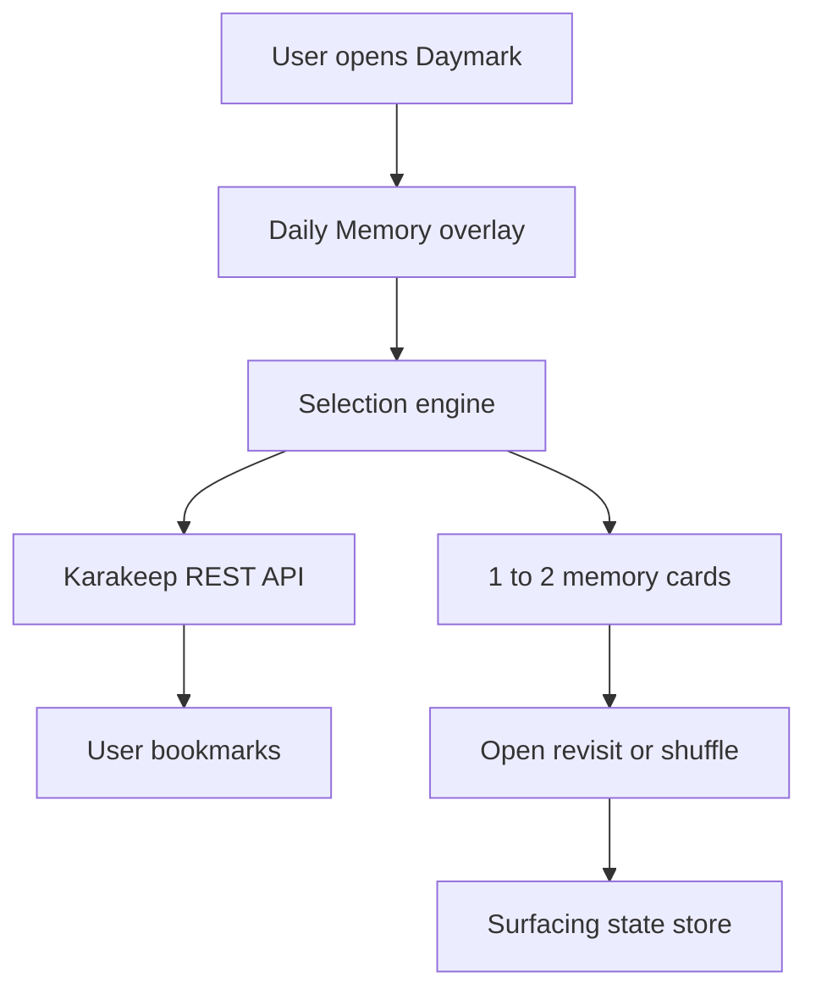

> **Status (MARK-1):** Daykeep/Karakeep has been removed from the product tree. Treat historical Phase 0–2 notes below as archive context only. Current stack: `apps/daymark` + `apps/api`.

# Second Brain — Plan (Karakeep + Daily Memory)

## Verdict

**Base:** [Karakeep](https://github.com/karakeep-app/karakeep) for capture, auth, search, AI tags.  
**USP:** **Daily Memory** — a beautiful daily resurfacing ritual that brings back 1–2 forgotten saves (links, reels, notes) as memory cards with a short overview.

We are not rebuilding Fabric. Capture is table stakes; *remembering* is the product.

---

## Daily Memory (USP)

### Problem

People save links “to read later” and never reopen them. Search only helps if you remember what to search for. Forgotten bookmarks die quietly.

### Solution

Every day, the web (and later mobile) surface opens with a subtle full-viewport **memory overlay**:

- Picks **1–2** items that deserve a second look (not favourites spam — *forgotten* ones)
- Shows a clean memory card: visual, title, short summary, when it was saved, tags/note
- One-tap reopen, mark revisited, or shuffle another

This is the “second brain that nudges you,” not another archive graveyard.

### Selection rules (v1)

Deterministic per user per calendar day (same day → same picks until shuffled):

1. Candidate pool: non-archived bookmarks older than **7 days**
2. Prefer never revisited / not opened recently (track `lastSurfacedAt` / `lastOpenedAt` in Daymark)
3. Prefer items with a summary, description, or user note (richer memory)
4. Soft diversity: avoid two items with the same top tag when possible
5. Exclude items surfaced in the last **14 days**

Fallback: if the pool is thin, relax age to 3 days, then any non-archived item.

### UX principles

- Overlay on top of the library — calm, not a dashboard of widgets
- First viewport = brand + today’s memory only (no stats strips)
- Cards exist because they *are* the interaction
- Motion: soft enter, image settle, dismiss fade — presence, not noise

### Surfaces

| Surface | v1 | Later |
|---------|----|-------|
| Web overlay (Daymark app / embed) | Yes | — |
| Mobile (Karakeep app or forked) | — | Same ritual on open |
| Optional email digest | No | Maybe |

---

## Product shape

**Private multi-user second brain** on one self-hosted instance.

- Auth required; each user has their own library
- Capture: paste URL, quick text/snippet, mobile share sheet
- Skip: browser extension work, email-to-inbox
- Sharing lists between users: later (Karakeep already supports it)

---

## Phases

### Phase 0 — Stock Karakeep

Deploy upstream Docker. Dogfood capture + search + official mobile share sheet. Log social enrichment gaps.

### Phase 1 — Daily Memory USP (build now)

Ship **Daymark**: a focused web experience that:

- Connects to Karakeep via REST API (Bearer key)
- Runs the daily selection engine
- Presents the memory overlay UI
- Tracks resurfaced / revisited locally (and later server-side)

Demo mode included so the UI is buildable without a live instance.

### Phase 2 — Soft-fork Karakeep

- Provider-aware extractors (YouTube / Instagram / TikTok)
- Controlled tag vocabulary + better summaries feeding Memory cards
- Optional: embed Daymark ritual into Karakeep’s own web shell
- List sharing between users on the instance

### Phase 3 — Mobile ritual

Official apps first; fork mobile only if we need the memory overlay natively on share/open.

---

## Architecture (Phase 1)

- **Karakeep:** source of truth for bookmarks  
- **Daymark:** ritual UI + selection + light state (what was shown / revisited)

---

## Hosting

- Karakeep: VPS + Docker Compose + HTTPS  
- Daymark: static/SPA on same host or Netlify, env `VITE_KARAKEEP_URL` + user API key in settings (browser local storage for personal use)

---

## Success metrics

- Users open and engage with Daily Memory ≥3 days/week
- Resurfaced items get reopened or explicitly dismissed (not ignored)
- “I forgot I saved this” moments happen regularly
- Cost stays at small VPS + optional LLM cents — not a Fabric seat
